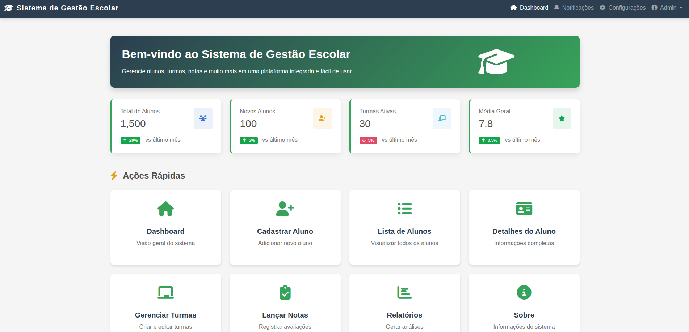

# 📚 Sistema de Gestão Escolar



Este trabalho apresenta o desenvolvimento de um sistema web para cadastro de alunos, focado em facilitar a gestão acadêmica. A solução conta com uma interface responsiva, transições dinâmicas, template adequado e uso de HTML, CSS, JavaScript e frameworks para o front-end. O projeto aplica conceitos de desenvolvimento web, interatividade e usabilidade, visando agilizar e melhorar o acesso aos processos acadêmicos, com foco em responsividade e UX.

### 👥 Desenvolvedores

- [Davi Serrão Lima](https://github.com/D4vi2205)
- [Rafael Góes Duarte](https://github.com/rafaelgoesti)
- [Marcus Paulo da Silva Batista](https://github.com/marcusbatistadev)
- [Luan Levi Barbosa de Carvalho](https://github.com/Luan-carvalho-b)
- [Emanuel Rodrigues ](https://github.com/Luan-carvalho-b)

---

## 🎯 Objetivo do Site

- **Objetivo**: Facilitar a gestão acadêmica com registro, atualização e consulta de dados dos alunos.
- **Funcionalidades**:

  - Cadastro de novos alunos (formulário).
  - Listagem de alunos registrados.
  - Visualização detalhada de perfil acadêmico.

- **Interface**:

  - Sistema de navegação intuitivo.
  - Paleta de cores e tipografia agradáveis.
  - Layout moderno, responsivo e amigável.

- **Tecnologias**:

  - Bootstrap para design responsivo.
  - HTML, CSS, JavaScript e frameworks para front-end.

- **Princípios**:

  - Usabilidade.
  - Responsividade.
  - Simplicidade.

- **Propósito final**: Otimizar o gerenciamento de informações estudantis, alinhado às boas práticas do desenvolvimento web.

## 💻 Tecnologias Utilizadas

-  HTML5: Estrutura básica (formulários, tabelas, botões).

-  Bootstrap: Estilização e componentes prontos para design responsivo.

-  CSS3: Ajustes de cores, fontes e layout.

-  JavaScript: Interatividade (validação de formulários, manipulação dinâmica de elementos).

## 🗂️ Criação das Páginas e Estrutura do Site

- **Desenvolvimento modular** com páginas específicas para cada funcionalidade
- **HTML5 semântico** para melhor legibilidade e manutenção
- **Cabeçalho padronizado** com navbar do Bootstrap em todas as páginas
- **Formulários intuitivos** usando classes do Bootstrap (`form-control`, `form-select`)
- **Design responsivo** garantido pelo Bootstrap
- **Exibição de dados**:
  - Tabelas na página **Lista de Alunos**
  - Listas de definição (`<dl>`) na página **Detalhes do Aluno**
- **Estrutura organizada** com separação clara de HTML, CSS e JavaScript
- **Projeto escalável** para fácil adição de novos campos, páginas ou funcionalidades

### 📂 Estrutura de Pastas e Arquivos

```SISTEMA-GESTAO-ESCOLAR
├── 📁 css
│   ├── cadastro-aluno.css
│   ├── detalhes-aluno.css
│   ├── index.css
│   ├── lista-de-alunos.css
│   ├── notas.css
│   ├── relatorio.css
│   ├── sobre.css
│   └── turmas.css
│
├── 📁 img
│   ├── imagem-readme
│   │   └── capa.png
│   ├── davi-lima.png
│   ├── emanuelrodrigues.png
│   ├── erminio.png
│   ├── igorfalcao.png
│   ├── luancarvalho.png
│   ├── marcusbabista.png
│   └── rafaelgoes.png
│
├── 📁 js
│   ├── cadastro-aluno.js
│   ├── detalhes-aluno.js
│   ├── index.js
│   ├── lista-de-alunos.js
│   ├── nota.js
│   ├── relatorio.js
│   └── turmas.js
│
├── cadastro-aluno.html
├── detalhe-aluno.html
├── index.html
├── lista-de-alunos.html
├── notas.html
├── relatorios.html
├── sobre.html
├── turmas.html
├── LICENSE
└── README.md
```

## ⚡ Interatividade com JavaScript

- **Navegação responsiva**
  - Menu mobile com Bootstrap + JS
- **Validação de formulários**
  - Verificação em tempo real dos campos
  - Feedback visual para erros
- **Manipulação dinâmica do DOM**
  - Mensagens instantâneas para o usuário
- **Filtros inteligentes**
  - Busca dinâmica na lista de alunos
- **Experiência fluida**
  - Resposta imediata às ações do usuário

_(Principais funcionalidades implementadas com JavaScript para tornar o sistema mais dinâmico e intuitivo)_

## 🧪 Testes

### ✔️ Testes Realizados

- **Navegação completa**
  - Verificação de todos os links e rotas
- **Validação de formulários**
  - Testes de submissão e tratamento de dados
- **Cross-browser**
  - Compatibilidade verificada no Chrome
- **Performance**
  - Otimização de carregamento (compressão de imagens)
- **Acessibilidade**
  - Análise de usabilidade e disposição dos elementos

### 🔍 Resultados

- Sistema estável e responsivo
- Experiência consistente em diferentes ambientes
- Interface intuitiva e acessível

_(Processo de teste completo para garantir qualidade e performance ideal)_

✏️ **Nota**: Testes contínuos são recomendados para futuras atualizações.

## 📱 Responsividade & UX

### 📲 Testes Multi-dispositivo

- Verificação em telas de 320px a 1920px
- Ajustes de layout para mobile/tablet/desktop
- Correção de desalinhamentos críticos

### 🎨 Experiência do Usuário

- Análise de fluidez em transições e animações
- Otimização de performance visual
- Garantia de navegação intuitiva

### ✅ Resultados

✔ Layout consistente em todos dispositivos  
✔ Interações suaves e sem lag  
✔ Interface acessível e agradável

_(Testes realizados via DevTools com simulação de diversos dispositivos)_

---

## 🚀 Como rodar o projeto

### Pré-requisitos

- ✅ Ter o **Git** instalado na sua máquina
- ✅ Ter um navegador atualizado instalado (Chrome, Firefox, Edge, etc.)

---

### 📥 Clonar o repositório

```bash
git clone https://github.com/sistema-gestao-escolar/sistema-gestao-escolar.git
```

---

### 📂 Acessar a pasta do projeto

```bash
cd SISTEMA-GESTAO-ESCOLAR
```

---

### 🖥️ Rodar o projeto

Basta abrir o arquivo `index.html` no navegador.

✅ Abra o **index.html**:

- Clique duas vezes no arquivo `index.html`
- Ou arraste para o navegador
- Ou use uma extensão como **Live Server** no VSCode para abrir no navegador (opcional).

---

## 🚀 Melhorias Futuras

### 🔍 Prioridades de Otimização

- **Acessibilidade Avançada**

  - Implementar ARIA labels
  - Compatibilidade total com leitores de tela
  - Navegação via teclado

- **Performance Turbo**
  - Compressão inteligente de assets
  - Lazy loading para imagens
  - Minificação de CSS/JS

### 🛡️ Segurança e Gestão

- **Sistema de Autenticação**

  - Login seguro com JWT
  - Níveis de permissão
  - Recuperação de senha

- **Painel Administrativo**
  - Dashboard de gestão
  - CRUD completo
  - Estatísticas de uso

### ✨ Experiência Premium

- **Mobile First 2.0**

  - Gestos específicos
  - Offline mode
  - PWA capabilities

- **Interações Imersivas**
  - Micro-interações
  - Transições contextuais
  - Feedback háptico

_(Roadmap evolutivo para versões futuras do projeto)_

💡 **Próximos Passos**:

1. Testes A/B com usuários reais
2. Priorização com matriz de impacto
3. Sprint de implementação modular

---
